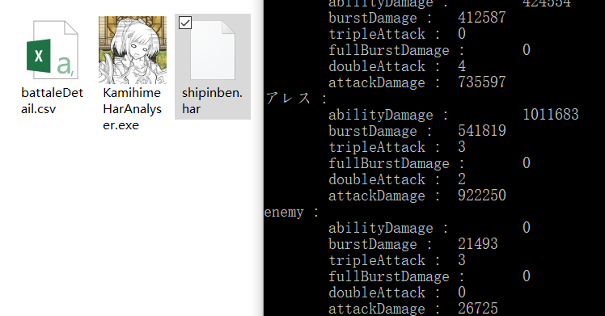

# KamihimeHarAnalyser
神姫プロジェクトの戦闘データ分析ツール/The Battle Data Analyser of Kamihime Project

ダウン‐ロード：
https://github.com/kisaragiHiyo/KamihimeHarAnalyser/releases

このツール、何に使う？
 このツールは、楽に大量なデータを分析するために、作ったプログラムである。

 

使い方：

１．
  バトルが始まったら、F12ボタンを押して、ブラウザーの開発者ツールを呼び出す。
  
  
   
 

  
  
２．
  NetworkとXHRを押して
  
  
   
 

  
  
  
３．
  その後、ゲームに戻して、適当に戦闘を行う。バトルとともに、たくさんのデータは自動的に記録される。
  バトルが終わったら、記録されたアイテムに右クリックして、Save as HAR with content を選択して、名をてけて全てのデータを保存する。
  
  
   
 

  
  
  
４．
  その後、ダウン‐ロードしたプログラムで、下の図のように保存したharファイルを開ける。
 
 
  
  
  
  
 
 
  
  
    
５．
   完成
 
 
   
   
  
 

Tips:
 
 保存したHARファイルは全てのデータを含めているので、もし一気に複数のバトルを記録するなら、HARファイルのサイズは非常に大きくなり、分析のスピードも遅くなる。
 そのため、左上のこのボタンを活用してください。
  
 このボタンで開発者ツールに記録された全てのデータを削除できる。このボタンを使い、複数のバトルに区切りをつけ、一つ一つのHARファイルに保存できる。

